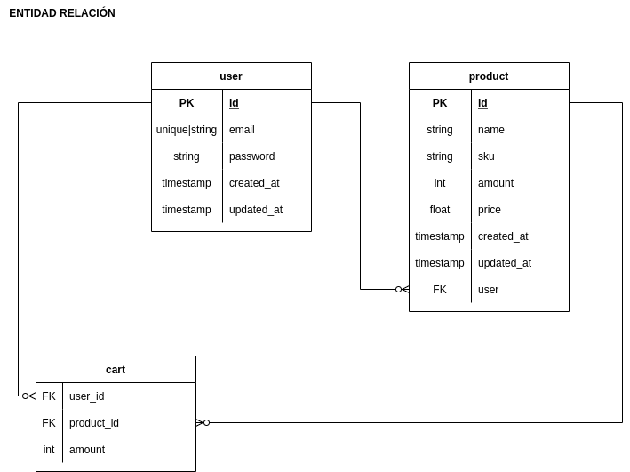
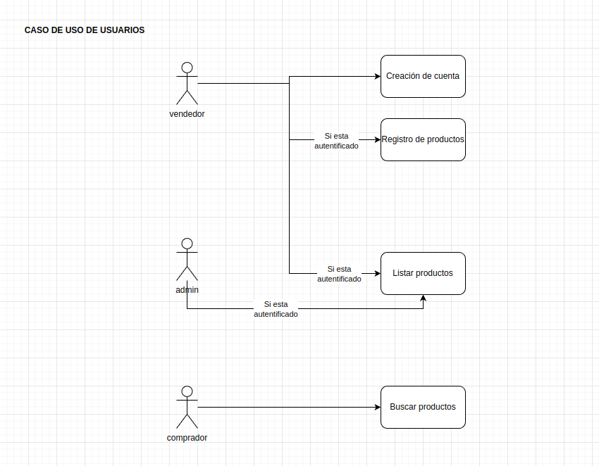
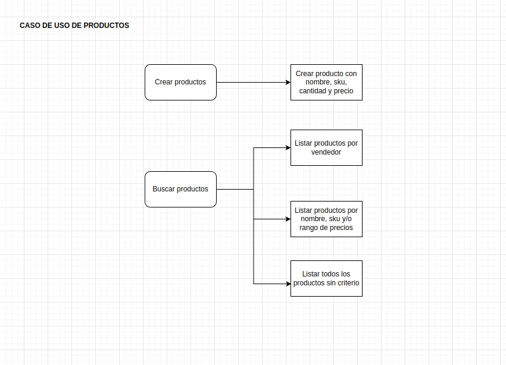

# Descripción

Prueba técnica YAYDOO FULLSTACK. Elaborar un Marketplace

## Requerimientos

- node v14.20.0
- npm v6.13.4
- docker

## Tecnologías

- NestJS
- Jest
- Yup
- Fishery
- Husky
- Prettier js
- Faker js

## Tests

Casos de uso
- Producto
    - when create a product
      - successfully
      - show message error when product exist
    - when get products
      - without filters
      - with filters
- Usuario
    - create user
    - show message error when user not exist

## Formatting code

`npm run format`

## DOCS

